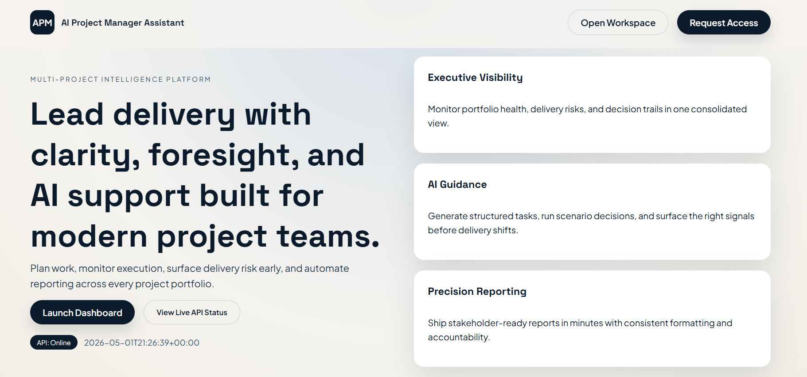

# AI Project Manager Assistant

An AI-powered project operations platform built to help teams plan, track, and execute projects with clarity, accountability, and real-time decision support.

Designed as a practical project management workspace, this platform combines structured execution workflows with AI-assisted planning, task generation, project health monitoring, and stakeholder-ready reporting.
---
## Preview



## Overview

AI Project Manager Assistant is a full-stack AI-powered project operations platform built to help teams plan, track, and execute projects with greater clarity, accountability, and operational intelligence.

It combines structured project execution with AI-assisted planning, delivery tracking, task generation, risk monitoring, decision support, and completion reporting in one unified workspace.

Unlike traditional task boards, this platform is designed to simulate how modern teams actually manage execution.

---

## Live Deployment

**Production URL:**
[https://ai-project-manager-asistant.vercel.app](https://ai-project-manager-asistant.vercel.app)


---

## Key Features

### Smart Workspace Management

* Create and manage multiple workspaces
* Organize projects by domain, team, or delivery stream
* Maintain structured execution environments

### Project Lifecycle Management

* Create and manage projects with:

  * Start date
  * End date
  * Owner
  * Priority
  * Status
* Track projects from planning to completion
* Cleanly manage and delete projects

### Intelligent Task Execution Board

* Kanban-style execution workflow
* Track tasks across:

  * Planned
  * In Progress
  * Review
  * Completed
  * Blocked
* Assign owners, due dates, and priorities
* Update execution state in real time

### AI Task Generator

Convert high-level execution goals into structured task drafts.

### AI Decision Assistant

Get execution-focused recommendations based on project context.

### Project Health Monitoring

Track live project delivery signals through:

* Risk score
* Risks
* Suggestions
* Completion trends
* Execution indicators

### Completion Reports

Generate structured project completion reports for:

* stakeholder visibility
* execution review
* delivery documentation

---

## Tech Stack

### Frontend

* HTML
* CSS
* Vanilla JavaScript

### Backend

* Python
* Flask
* REST API

### Deployment

* Vercel (Frontend)
* Render (Backend)

---

## Project Structure

```bash
AI-Project-Manager-Asistant/
│
├── backend/
│   ├── data/
│   │   └── data.json
│   ├── routes/
│   │   ├── ai_routes.py
│   │   ├── project_routes.py
│   │   └── task_routes.py
│   ├── services/
│   │   ├── ai_service.py
│   │   ├── data_service.py
│   │   ├── project_service.py
│   │   └── task_service.py
│   ├── utils/
│   │   └── errors.py
│   ├── app.py
│   ├── config.py
│   ├── requirements.txt
│   └── wsgi.py
│
├── docs/
│   └── preview.png
│
├── frontend/
│   ├── index.html
│   ├── dashboard.html
│   ├── app.js
│   ├── styles.css
│   └── vercel.json
│
└── README.md
```

---

## How It Works

1. Create a workspace
2. Add a project
3. Break execution into tasks
4. Track tasks through the execution board
5. Generate AI-assisted tasks and decisions
6. Monitor project risks and signals
7. Complete the project and generate reports

---

## Local Setup

### 1. Clone the Repository

```bash
git clone https://github.com/hiteshgowda017/AI-Project-Manager-Asistant.git
cd AI-Project-Manager-Asistant
```

### 2. Setup Backend

```bash
cd backend
python -m venv venv
venv\Scripts\activate
pip install -r requirements.txt
python app.py
```

Backend runs on:

```bash
http://127.0.0.1:5000
```

### 3. Setup Frontend

Open `frontend/index.html` in your browser
or run it using VS Code Live Server.

---

## Environment Configuration

Set the frontend API base URL:

```env
API_BASE_URL=https://ai-pm-backend-0lfc.onrender.com/api/v1
```

For local development:

```env
API_BASE_URL=http://127.0.0.1:5000/api/v1
```

---

## Why This Project Stands Out

AI Project Manager Assistant is more than a CRUD-based project tracker.

It is designed as a lightweight execution intelligence platform that combines:

* structured planning
* execution tracking
* AI-assisted task generation
* risk visibility
* operational reporting

This makes it a practical AI product focused on real execution workflows rather than basic task storage.

---

## Future Improvements

* Authentication & user roles
* Team collaboration
* Real-time sync
* File attachments
* Smart deadline forecasting
* Slack / Email integrations
* Advanced analytics dashboard

---

## Author

**Hitesh Gowda**
AI & Data Science Engineering Student
Focused on building practical AI systems and execution-driven products.

* GitHub: [https://github.com/hiteshgowda017](https://github.com/hiteshgowda017)

---

## License

This project is open-source and available under the MIT License.
